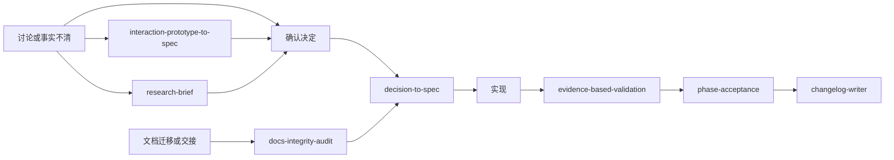

# Mo.s-Skill

一组中文优先、可组合的 Agent Skills，用于把软件开发中最容易失控的环节拆开处理：讨论何时算定案、怎样把决定写进文档、一个改动如何留下证据、一个阶段是否真的能交付，以及发布前的 Git 动作由谁确认。

这些不是一套接管项目的“大流程”。每个 Skill 只解决一个明确问题，输出可复核的结果，并在产品取舍、真实环境、写入正式文档和 Git 操作前保留人工确认。

## 适用场景

Agent 在代码工作中常见的失败不是不会生成代码，而是过早把猜测写成决定、把本机结果说成真实环境通过，或在没有确认的情况下扩大修改和 Git 操作。Mo.s-Skill 将这些问题拆成职责清楚的入口：

| 你现在的问题 | 使用的 Skill | 主要交付物 |
| --- | --- | --- |
| 一个阶段、版本或里程碑是否能交付 | `phase-acceptance` | 验收报告、通过或阻塞结论 |
| 已确认的讨论怎样同步到规格、ADR 和规划 | `decision-to-spec` | 文档更新与同步报告 |
| 文档迁移后是否有断链、旧路径、状态漂移 | `docs-integrity-audit` | 文档完整性审计报告 |
| 一处功能或修复到底怎样才算验证到位 | `evidence-based-validation` | 单改动验证卡和证据边界 |
| 复杂交互还拿不准，想先体验再定规则 | `interaction-prototype-to-spec` | 原型结论与交互契约 |
| 需要交给独立 Agent 做有边界的调研 | `research-brief` | 调研任务书和接收条件 |
| 准备记录版本改动，决定是否提交或推送 | `changelog-writer` | 两种更新日志与经确认的 Git 动作 |
| 一组 Skill 更新后，想核对真实触发和协作关系 | `skill-workflow-visualizer` | 选择表、工作流图和待核实项 |

完整的适用条件、边界和常见串联方式见 [docs/skill-selection.md](docs/skill-selection.md)。

## 工作方式



这条图不是强制流水线。应当从当前最直接的问题开始：单个改动不需要阶段验收；尚未定案的想法不能直接进入文档同步；调研任务书不会自动派发调研。完整转交规则和人工确认点见 [docs/workflows.md](docs/workflows.md)。

## 安装

`skills/` 是本仓库唯一的自有发布内容：每个子目录都包含标准的 `SKILL.md`。未特别指定时，安装的是不含 `evals/` 的使用版；只有维护、修改或评测 Skill 时才保留完整目录。运行时需要的引用文件仍会随使用版安装。详细文件规则见 [docs/installation.md](docs/installation.md)。当需要收敛未决方案或执行实际调研时，推荐搭配 Matt Pocock Skills 的 `grill-with-docs` 和 `research`，但项目也可使用职责等价的既有流程。详情见 [docs/curated-tiers.md](docs/curated-tiers.md)。仓库不假设所有 Agent 使用同一种插件系统，也不提供冒充通用方案的安装脚本。

请选择你的 Agent 支持的方式：

1. **项目本地安装**：将所需的使用版文件从 `skills/` 复制到项目所用的 Skill 发现目录。适合希望版本跟随项目、便于审查和定制的团队。
2. **个人全局安装**：复制所需的使用版文件到 Agent 的用户级 Skill 目录。适合个人复用，但具体目录和加载规则必须以该 Agent 当前文档为准。
3. **原生市场或插件系统**：当某个 Agent 支持从 Git 仓库、插件市场或注册表安装时，优先使用该 Agent 的原生方式。它能处理更新、权限和卸载，不需要本仓库替它猜目录。

常见 Agent 的可行方式、复制示例和更新原则在 [docs/installation.md](docs/installation.md)。先安装一个 Skill 并在真实请求中验证其是否被发现，再扩展到整套 Skill。

原有的三档精选仍然保留为安装范围参考：[`own`、`recommended`、`all`](docs/curated-tiers.md)。它们不再依赖一个只覆盖少数 Agent 的脚本。

## 上游精选

本仓库维护八个原创 Skill，并以 [MIT License](LICENSE) 发布。没有复制第三方 Skill 正文。

我们也记录了一组上游项目。其中 Matt Pocock Skills 的 `grill-with-docs` 和 `research` 是完成相关 Mo 工作流时的默认推荐搭档；其余条目是按需补充，不是“一键全装”套件。每个项目的许可证、目录布局、支持的 Agent 和安装方式各不相同，应从其官方渠道单独安装和更新。来源、许可边界与选择理由见 [docs/source-attribution.md](docs/source-attribution.md)；可参考的来源索引位于 `manifests/`。

## 维护与贡献

- [CONTRIBUTING.md](CONTRIBUTING.md)：自有 Skill 的结构、评测和发布规则。
- [docs/skill-selection.md](docs/skill-selection.md)：按问题选择 Skill 的详细说明。
- [docs/workflows.md](docs/workflows.md)：协作关系、人工关口和输出边界。
- [docs/installation.md](docs/installation.md)：多 Agent 安装与更新策略。
- [docs/curated-tiers.md](docs/curated-tiers.md)：`own`、`recommended`、`all` 三档内容与选择原则。
- [docs/source-attribution.md](docs/source-attribution.md)：自有内容与第三方内容的许可边界。

维护者可执行以下命令检查八个自有 Skill 的结构和来源索引的 JSON 语法：

```powershell
./scripts/validate.ps1
```