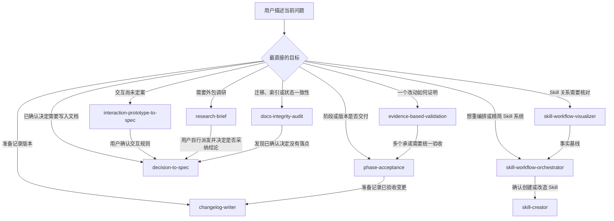
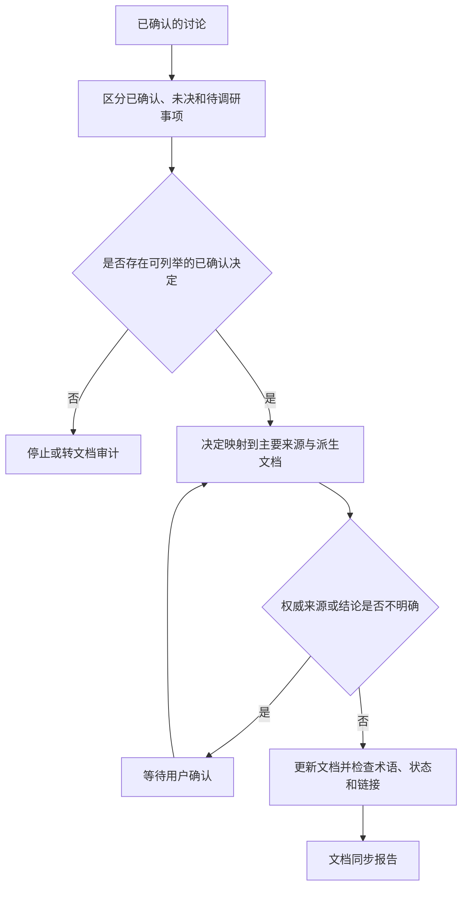
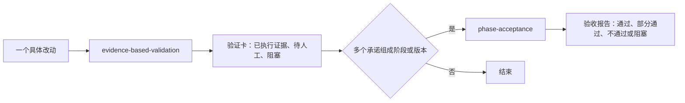
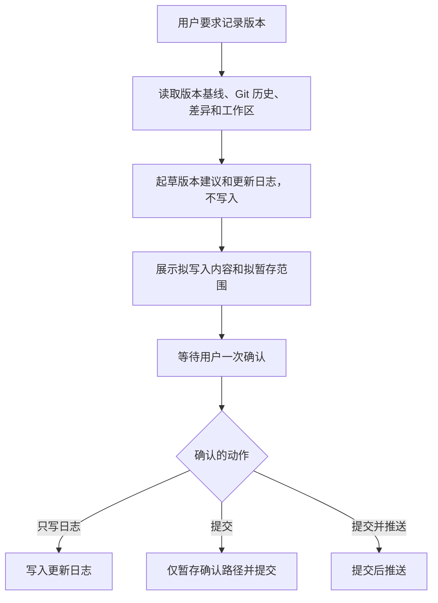

# Skill 协作与人工关口

本页描述的是基于当前九个 `SKILL.md` 的协作边界。它不要求 Agent 自动串联所有步骤，而是说明一个工作流完成后，下一步何时应由用户选择，何时只是一条建议。

## 总览

箭头表示可能的后续选择，不代表自动调用。任何需要新的项目决定、外部授权或 Git 操作的箭头都应停在用户确认处。

## 决定同步

`decision-to-spec` 的关键约束是只同步已经确认的决定。它不是用来逼用户马上作出决定，也不会把调研报告自动变成规格。

## 单改动验证与阶段验收

两者不应混用。前者回答“这一处被证明了吗”，后者回答“这次交付承诺是否兑现”。真实浏览器、设备、权限和预发布环境无法由 Agent 直接验证时，报告必须保留待人工步骤和预期证据。

## 发布记录与 Git 确认

`changelog-writer` 不会因为发现改动就自行提交。确认必须覆盖版本号、日志内容、Git 动作和暂存范围。

## 原型与调研的边界

| 场景 | 正确入口 | 人工关口 | 不应发生的事 |
| --- | --- | --- | --- |
| 复杂交互需要先体验 | `interaction-prototype-to-spec` | 用户确认入口、状态、数据和权限取舍 | 把原型当作生产实现或正式规格 |
| 需要把重要问题交给独立 Agent 研究 | `research-brief` | 用户确认范围、版本和证据标准；之后自行决定是否派发和采纳 | 自动派发、自动采纳研究建议 |
| 文档迁移后链接和状态可能出错 | `docs-integrity-audit` | 用户确认已证实机械修复的范围 | 擅自改写业务决策或删除历史资料 |

## 维护工作流说明

当本仓库中的某个 Skill 修改时，`skill-workflow-visualizer` 可从现行 `SKILL.md` 重新提取事实，再检查本页和 [skill-selection.md](skill-selection.md) 是否过期。流程图的依据应始终是实际 Skill 正文，而不是 Skill 名称、旧图或使用习惯。