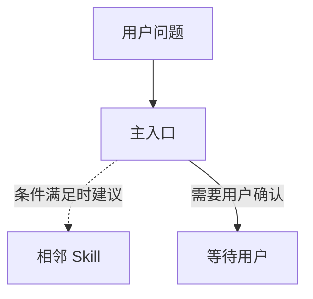

# Skill 工作流重编排

这个 Skill 把“已有 Skill 实际如何协作”的事实，转化为一份可供用户选择的工作流重编排方案。它解决的是：哪些问题缺少主入口、哪些 Skill 职责重叠、哪些重复工作值得封装、以及现有工作流应如何收敛。

它不负责猜测已有 Skill 的行为，也不直接编写新 Skill。前者由 `skill-workflow-visualizer` 完成，后者由 `skill-creator` 完成。

## 适用边界

- 先读取或要求用户提供 `skill-workflow-visualizer` 的当前结果；没有结果时，先调用或建议调用它，从真实 `SKILL.md` 建立事实基线。
- 用户明确授权且当前环境提供历史工具时，可以使用可访问的跨项目聚合使用模式，发现反复出现的工作、常见转交和摩擦点；历史频率不是保留、删除或创建 Skill 的充分证据。
- 默认只交付重编排方案与新 Skill 候选，不创建、修改、删除、安装、卸载或移动任何 Skill、项目设置、业务代码或 Git 状态。
- 用户确认变更范围后，才更新工作流文档、安装范围或清单；用户确认要创建、改造或评测某个 Skill 后，才转交 `skill-creator`。
- 不把跨 Agent 的同名同步副本当作冗余。只有同一作用域内的职责和触发重叠，才是精简候选。
- 不因低频自动删除 Skill。低频但边界明确、风险高或只在专门场景使用的能力，可以保留为按需入口。

## 1. 建立事实基线

先收集以下内容，并清楚分开记录来源：

| 来源 | 用途 | 不能证明什么 |
| --- | --- | --- |
| `skill-workflow-visualizer` 结果 | 当前 Skill 的触发、前提、输出、人工关口和实际转交 | 用户是否喜欢或经常使用它 |
| 当前 `SKILL.md` 与项目规则 | Skill 现在真实能做什么、受什么约束 | 历史使用频率 |
| 用户明确授权的跨项目历史 | 重复任务、常见起点、转交模式和摩擦 | 当前项目的硬性流程或用户的新决定 |
| 用户当前目标 | 要优化哪个范围、允许哪些变更 | 未明确的个人偏好 |

缺少可视化事实基线时，停在这里：先完成 `skill-workflow-visualizer`，不要根据 Skill 名称、安装来源或记忆直接建议删改。

## 2. 找出重编排候选

按下面四类整理候选。每项都必须能关联到当前事实和用户目标。

| 类型 | 何时提出 | 默认动作 |
| --- | --- | --- |
| 主入口收敛 | 多个 Skill 在同一问题上竞争触发，且其中一个可承担主要路径 | 指定主入口，其他项标为条件转交或按需入口 |
| 转交补齐 | 某个任务经常卡在缺少下一步、错误转交或人工关口不清 | 补充前提、用户确认点和下一步条件 |
| 精简或降级 | Skill 与主入口输出高度重叠、无实际场景，或只是占位模板/运行产物 | 建议删除、合并、停用或降为按需参考 |
| 新 Skill 候选 | 用户在多个任务或项目中反复执行同一稳定工作，且现有 Skill 组合无法清楚承接 | 写出候选契约，等待确认后转 `skill-creator` |

新 Skill 候选必须同时满足：

1. **重复且稳定**：在多个任务或项目中反复出现，步骤不是一次性业务细节；
2. **边界可说明**：输入、触发语境、主要步骤、输出和不负责什么能够写清；
3. **现有能力不够**：不能仅通过指定一个主入口或补一条转交规则解决；
4. **封装有收益**：能减少反复判断、遗漏步骤或不一致输出，而不是制造又一个模糊入口；
5. **可评测**：至少能写出 2 到 3 个现实的触发示例，用于后续 `skill-creator` 评测。

## 3. 形成重编排方案

每份方案必须包括：

```markdown
# [范围] Skill 工作流重编排方案

## 事实基线
- 可视化依据：
- 已读取的当前 Skill：
- 历史范围与限制（如已授权）：
- 用户目标与不可改变的约束：

## 当前问题
| 问题 | 证据 | 影响 | 类型 |
| --- | --- | --- | --- |

## 重编排候选
| 候选 | 类型 | 当前事实 | 历史观察（如有） | 建议变化 | 收益 | 风险与待确认决定 |
| --- | --- | --- | --- | --- | --- | --- |

## 新 Skill 候选
### [候选名称]
- 要解决的重复工作：
- 触发语境：
- 输入与前提：
- 核心步骤：
- 输出：
- 不负责什么：
- 现有 Skill 为什么不能直接承担：
- 初始评测场景：

## 建议工作流


## 需要用户一次确认的决定
- 保留、降级、合并或删除哪些候选：
- 是否更新工作流文档或安装范围：
- 是否创建或改造哪些新 Skill：
- 如创建/改造，交给 `skill-creator` 的范围：
```

候选方案必须区分“事实已经证实”“历史观察”“用户尚未确认的建议”。只因历史观察得出的候选不得被画成既定流程。

## 4. 一次确认后执行

展示完整方案后，使用当前 harness 的原生选择工具或等价一次性确认，收集：

1. 采用、拒绝或修改哪些主入口与转交候选；
2. 哪些 Skill 保留、降为按需、合并或删除；
3. 是否更新工作流文档、安装范围或清单，以及准确文件范围；
4. 是否创建或改造新 Skill；若是，确认候选名称、范围和评测期望。

确认后按选择执行：

- **只采纳编排**：更新确认的工作流文档或安装清单，并复查路径、Skill 正文证据和 Mermaid 图。
- **创建或改造 Skill**：将已确认的新 Skill 候选契约、评测场景和边界转交给 `skill-creator`。本 Skill 不替代其设计、评测和迭代流程。
- **删除或卸载**：先展示准确路径、作用域和影响；再次确认删除范围后才执行。跨 Agent 副本、来源不明文件和项目本地定制不得默认删除。
- **只要方案**：不修改任何文件，只交付重编排方案。

## 与相邻 Skill 的边界

- `skill-workflow-visualizer`：建立当前事实基线并可视化；本 Skill 在此基础上提出重编排与新 Skill 候选。
- `skill-creator`：设计、编写、评测和迭代已确认的新 Skill 或改造项；本 Skill 只提供经过确认的候选契约。
- `docs-integrity-audit`：审计项目文档体系的链接、状态与权威来源；本 Skill 只调整 Skill 工作流与安装范围。
- `decision-to-spec`：同步已确认的产品或架构决定；本 Skill 不把工作流建议自动升级为项目规格。
- `health`：审计 Agent 指令、MCP、hooks 与验证面；本 Skill 专注 Skill 组合与重复工作封装。

## 常见错误

- 没有先读真实 `SKILL.md` 和可视化结果，就按名称建议删改。
- 因历史低频、单次失败或来源不同就删除一个 Skill。
- 把一个特定项目的业务步骤误封装成通用 Skill。
- 有了新 Skill 想法就直接创建，跳过用户确认和 `skill-creator` 的评测流程。
- 让新 Skill 覆盖已有主入口却没有明确新的触发边界。
- 把历史观察、优化建议和用户已确认的工作流写成同一种事实。
