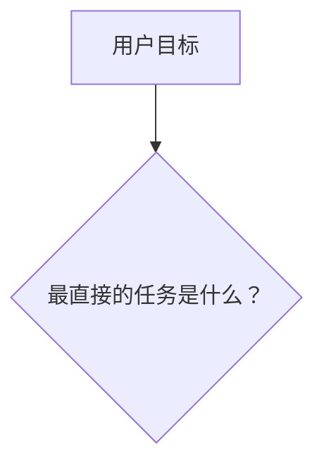
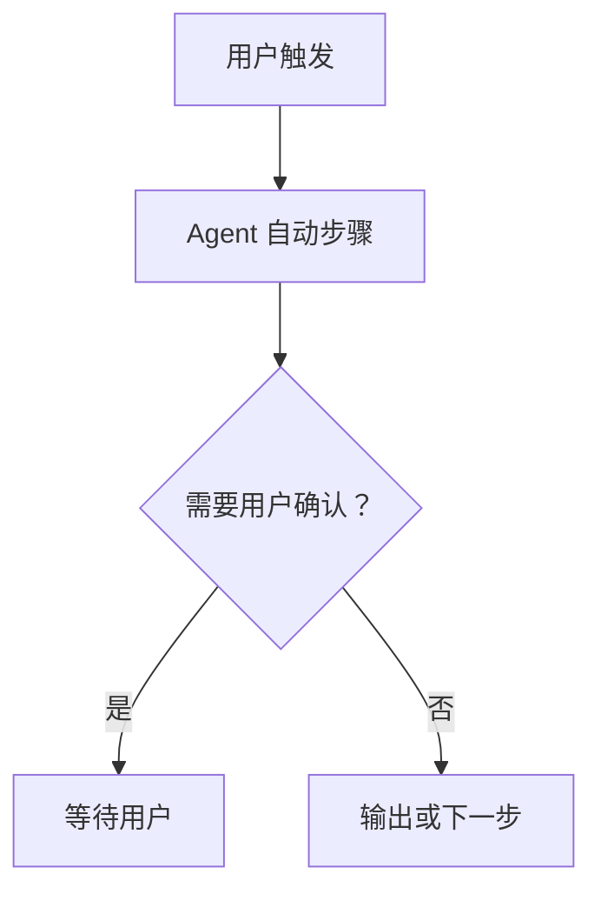

# Skill 工作流可视化

这个 Skill 把一组 Skill 的实际运行规则转成可复核的说明，而不是根据名称猜测流程。目标是让人一眼看出：什么时候选哪个 Skill、Agent 会自动做什么、哪里必须由人决定、结果应如何交给下一个环节。

## 适用边界

- 输入可以是指定的 Skill 名称、一个 Agent 的 Skill 目录，或现有的工作流文档。
- 默认输出 Markdown 说明和 Mermaid 图；除非用户明确要求，不创建、修改或删除任何 Skill、项目设置、业务代码或 Git 状态。
- 用户要求“更新流程图”时，只修改已证实过期的工作流文档；不借机重写被分析 Skill 的 `SKILL.md`。
- Skill 名称相同不等于重复。先确认它们是否属于不同 Agent 的同步副本；只分析同一 Agent 内的触发重叠。
- 不把 Skill 中的“推荐后续动作”画成自动执行。只有明确的工具调用或用户授权才可画为自动链路。

## 1. 建立分析范围

先读取项目指令、当前工作流入口和用户指定的 Skill。范围不明确时，使用下面优先级：

1. 用户明确点名的 Skill；
2. 当前工作流文档中已出现、且与用户目标相邻的 Skill；
3. 只有在用户要求全量盘点时，才扩展到一个 Agent 的全部 Skill。

记录每个 Skill 的实际路径、所属 Agent、版本或更新时间线索。若路径不存在，报告缺失，不猜测内容。

## 2. 以正文为准提取事实

对每个重点 Skill，读取 `SKILL.md` 的 frontmatter 和足以决定流程的正文。提取并标注：

| 事实 | 要回答的问题 |
| --- | --- |
| 触发条件 | 用户说什么、提供什么输入时应使用它？ |
| 输入与前提 | 它需要哪些文件、环境、权限、已有决定或用户确认？ |
| 自动步骤 | Agent 可以自行做哪些读取、检查、生成或验证？ |
| 人工关口 | 哪些选择、体验、凭据、真实环境或 Git 动作必须等待用户？ |
| 输出 | 它交付什么文件、结论、计划、报告或状态？ |
| 转交 | 什么条件下建议或要求使用其他 Skill？是建议、显式调用还是自动调用？ |
| 禁止项 | 它明确不做什么，避免和相邻 Skill 混淆？ |

不要从 Skill 名称、旧流程图、会话记忆或上游 README 推断行为。当前 `SKILL.md` 与其明确引用的运行文档冲突时，以运行文档指定的优先级为准，并在报告中说明。

## 3. 区分四类连线

所有 Mermaid 连线必须标明实际关系，避免把建议画成强制流程：

| 类型 | 图中写法 | 含义 |
| --- | --- | --- |
| 自动转交 | `-->`，标注“自动调用” | 当前 Skill 明确会调用或必须调用下一项。 |
| 用户选择 | `-->`，标注“用户明确要求” | 用户确认后才可进入下一项。 |
| 条件建议 | `-.->`，标注“建议” | 当前 Skill 只指出合适的后续方向。 |
| 外部执行 | `-->`，标注“用户/独立 Agent 执行” | 当前 Agent 不拥有该动作。 |

不要画出不存在的自动链路。例如“计划已批准”不等于自动实现，“研究报告完成”不等于自动采纳，“讨论结束”不等于自动写 ADR 或规格。

## 4. 输出工作流文档

默认使用用户语言。文件位置遵循项目现有文档结构；没有既定位置时，只在对话中交付草稿并建议路径，不擅自创建长期文档。

输出使用以下结构：

```markdown
# [范围] Skill 触发与协作工作流

## 范围与依据
- 分析的 Agent/目录：
- 已读取的 Skill：
- 未读取或无法确认的项：
- 生成日期：

## 快速选择
| 当前目标 | 主 Skill | 选择理由 | 不负责什么 |
| --- | --- | --- | --- |

## 总览


## [Skill 名称]：一句话职责


**输入与前提**：

**自动完成**：

**必须由用户确认**：

**输出与边界**：

## 发现与待核实
| 项目 | 证据 | 影响 | 建议 |
| --- | --- | --- | --- |
```

图中节点应短、可读、单一职责。复杂分支拆成两张图，不堆成无法阅读的“大图”。所有用户确认节点必须明确写出“等待用户”。

## 5. 检查与更新

生成或修改工作流文档后，至少检查：

1. 每个画入流程的 Skill 都有实际 `SKILL.md` 证据；
2. Mermaid 代码围栏成对闭合；
3. 没有把建议连线写成自动转交；
4. 同名跨 Agent Skill 没有被误报为重复；
5. 已移除或不存在的 Skill 没有被写成可用入口；
6. 人工关口与 Skill 正文一致，尤其是用户决策、凭据、真实环境和 Git 动作；
7. 文档中的路径、数量、版本或目录统计与当前文件树一致。

发现旧图与当前正文冲突时，列出“旧规则 -> 当前规则 -> 证据来源”，并只修正已证实的节点和连线。无法确认时标为待核实，不自行选择一边。

## 与相邻 Skill 的边界

- `skill-creator`：创建、修改和评测某个 Skill；本 Skill 只解释和可视化多 Skill 协作。
- `docs-integrity-audit`：审计整个项目文档体系；本 Skill 聚焦 Skill 触发与转交规则。
- `decision-to-spec`：把已确认产品或架构决定写入正式文档；本 Skill 不把工作流分析自动升级成项目决定。
- `research`：调查事实；本 Skill 只在需要确认 Skill 当前行为时读取其本地正文或指定上游来源。

## 常见错误

- 只读 description 就绘制流程，不读 `SKILL.md` 正文。
- 把“建议使用 X”画成“自动调用 X”。
- 把 Agent 能查到的事实改为让用户回答。
- 把用户确认方案、批准计划和明确授权实现混为同一个关口。
- 把历史流程图当成当前事实，漏掉上游 Skill 更新。
- 为了美观删除限制、失败分支或人工关口。